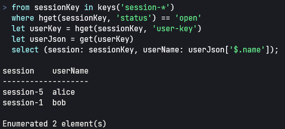

# redis-q


A REPL to run queries against a [Redis](https://www.redis.io) database using a language similar to C#'s `from` clause.



## Features

Redis-Q
- works with [Redis](https://www.redis.io) 5 or newer
- supports the basic Redis data types: string, list, hash, set and sorted set
- allows you to write queries in a relational manner to examine the data stored in your Redis instance
- supports well known operations like cross join and sub-queries as well as aggregations like sum, avg, distinct, count, min and max
- is able to extract JSON values using JSON-Path
- works on any desktop platform
- only supports query (read) commands - use `redis-cli` for writing to the database

## Installation

* Download and extract the [release zip file](https://github.com/smackem/redis-q/releases) fitting your platform to any directory
* From this directory, run `redis-q` to connect to redis at localhost:6379
* To connect to a different host or port, enter `redis-q <hostname>:<port>`
* `redis-q --help` shows all command-line options

## Samples

Assume you create a sample data set in your redis instance (using `redis-cli`) consisting of users and sessions, where one user is associated to n sessions:
```redis-cli
SET user-1 '{ "name":"bob" }'
SET user-2 '{ "name":"alice" }'
HSET session-1 user-key user-1 status open startTime "2022-04-01 22:03:54"
HSET session-2 user-key user-1 status closed startTime "2022-03-29 20:14:02"
HSET session-3 user-key user-1 status closed startTime "2022-03-30 21:03:51"
HSET session-4 user-key user-2 status closed startTime "2022-03-30 19:22:51"
HSET session-5 user-key user-2 status open startTime "2022-04-01 19:22:30"
```
Now start redis-q and enter the following query to join users and sessions:
```csharp
from userKey in SCAN("user-*")
from sessionKey in SCAN("session-*") 
where HGET(sessionKey, "user-key") == userKey 
   && HGET(sessionKey, "status") == "open"
let sessionStart = HGET(sessionKey, "startTime")
select (user: userKey, loggedInSince: sessionStart);
```

```
user    loggedInSince      
---------------------------
user-2  2022-04-01 19:22:30
user-1  2022-04-01 22:03:54
```
The following query will display id ('key') and name of users that are currently logged in: 
```csharp
from userKey in SCAN("user-*")
let openSessionCount = 
    from sessionKey in SCAN("session-*") 
    where HGET(sessionKey, "user-key") == userKey 
    where HGET(sessionKey, "status") == "open" 
    select sessionKey 
    |> count()
where openSessionCount > 0
let userJson = GET(userKey) 
select (key: userKey, name: userJson[".name"]);
```

```
key     name 
-------------
user-2  alice
user-1  bob  
```

## Syntax
redis-q (or more precisly RedisQL, the query language employed by redis-q) uses a slightly extended subset of C#'s LINQ syntax extension:

https://docs.microsoft.com/en-us/dotnet/csharp/language-reference/keywords/from-clause

RedisQL adds the following language features not supported by C#:
| Feature | Example |
| --- | ---|
| F#-like argument pipelining | `[1,2,3] \|> join(',')` |
| Ranges | `collect(0..100)` |
| Single-quoted or double-quoted string literals | `'hello' + ", world"` |
| List expressions | `[1, true, 'string']` |
| Regex operator | `"abc" ~= "\w{3}" // true` |
| Top-level `let` statements | `let x = 1` |
| The `limit` clause | `from ... limit 10 offset 1 ...` |
| Case-insensitive function names | `SCAN('*')` is the same as `scan('*')` |

### Basics and operators
RedisQL supports the following operators, basically a subset of the common operators found in C, C# or Java:
| Operator | Description |
| --- | --- |
| `condition ? a : b` | a if condition is true, otherwise b |
| `a == b` | Test for equality |
| `a != b` | Test for inequality |
| `a < b` | Less than |
| `a <= b` | Less than or equal |
| `a > b` | Greater than |
| `a >= b` | Greater than or equal |
| `a ~= b` | String-like value a matches the regex pattern b |
| `a + b` | Add numbers a and b or concatenate strings, if a or b is a string |
| `a - b` | Subtract number b from number a |
| `a * b` | Multiply numbers a and b |
| `a / b` | Divide number a by number b |
| `a % b` | Modulo of numbers a and b |
| `a ?? b` | a if not null, otherwise b |

Automatic type conversion: integer is automatically converted to real in expressions like `1 + 2.5`.
When operators require a string-like type, RedisQL converts operands implicitly to string.

### The `from` expression
Like C#'s `from` expression, RedisQL's `from` is a lazy iteration construct that enumerates all values in the source collection and binds each value to the iterator identifier.

Simple example: `from x in 1..3 select x` selects the identity of the source range `1..3`, the numbers 1, 2 and 3.
In this case, the range `1..3` is the source collection and `x` is the iterator identifier.

The source collection may be any enumerable value: ranges, lists and enumerables produced by functions or other `from` expressions.

The selection may be any expression using any bindings declared by the `from` expression, e.g.
`from x in 1..3 select x + 1`, which selects 2,3 and 4.

Nested bindings allow storing of intermediate results withing the `from` expression:
```csharp
from x in [1,2,3]
let s = x * x
select (base: x, squared: s);
```
```
base  squared
-------------
1     1      
2     4      
3     9      
```

Carthesian products ("cross joins" in SQL) can be produced by chaining `from` clauses:
```csharp
from x in [1,2,3]
from y in [10,11]
select (x: x, y: y, product: x * y)
```
```
x  y   product
--------------
1  10  10     
1  11  11     
2  10  20     
2  11  22     
3  10  30     
3  11  33     
```
Filtering of enumerables can be achieved using the `where` clause:
```csharp
from x in 1..10
where x % 2 == 0
select x
```
```
  2
  4
  6
  8
  10
```

Ordering of items can be achieved with the `orderby` clause:
```csharp
from x in [15, 4, -10, 30, -22]
let squared = x * x
orderby x
select (x: x, squared: squared)
```
```
x    squared
------------
-22  484    
-10  100    
4    16     
15   225    
30   900    
```
To reverse the sort order, use the `descending` keyword:
`from x in 1..10 orderby x descending select x` basically is the same as `1..10 |> reverse()`.

Limiting the result set can be achieved with the `limit` clause, which is familiar from SQL:
```csharp
from x in [1,2,3,4,5,6,8,9,10] 
where x % 2 == 0 
limit 3 offset 1 
select x;
```
```
  4
  6
  8
```

Note that the `offset` clause is optional and the default offset is 0.

When working with large data sets, including a `limit` clause in all queries against keyspace-scans (like `keys()` or `zscan()`) is good practice.

### Functions and Pipelining
redis-q features a collection of built-in functions, which can be invoked as usual in languages like C or Java:
```csharp
count([1,2,3]);
```
```
3
```
All Redis-specific functionality in redis-q is built using functions. A full list of supported functions can be found below.

One feature taken from F# comes in handy for a REPL: the possibility to pipe arguments to a function call using the `|>` operator. The above sample can also be written like this:
```csharp
[1,2,3] |> count()
```
The operand preceding the `|>` operator is passed as the _last_ argument to the function on the right.
This enables fluent typing of expressions like
```csharp
from x in [1,2,3,2,1]
select x
|> distinct();
```
```
1
2
3
```
or the following:
```csharp
from x in [15, 4, -10, 30, -22]
let squared = x * x
orderby x
select squared
|> join("+");
```
```
484+100+16+225+900
```

## Data Types
RedisQL is a dynamically-typed language supporting scalar values like integers or strings as well as composite values like lists, enumerables and tuples.

### Scalar types
RedisQL supports the following scalar data types:
| Name | Description | Literal |
| --- | --- | --- |
| int | 64 bit signed integer | `100` or `1_000_000` |
| real | 64 bit floating point | `12.5` or `1_125.000_001` |
| string | unicode string of arbitrary length | `"hello"` or `'world'` |
| bool | boolean value | `true` or `false` |
| timestamp | date and time | see below |
| duration | a time span | see below |

Redis values are implicitly converted to the type required by the operation.
Redis keys are implictly convertible to string.

### Conversion to Boolean
All RedisQL values except tuples and lazy enumerables can be converted to boolean:
| Type | `false` if |
| --- | ---|
| list | empty |
| string | empty |
| integer | 0 |
| real | 0.0 |
| bool | false |
| any | null |
| duration | zero |

### Enumerables, List and Ranges
Enumerables in RedisQL are lazily evaluated, whereas lists are discrete collections (as in dotnet `IEnumerable` vs. `IList` or in `Stream` vs. `Collection` in Java).
Enumerables and lists are displayed differently:
`1..3` evaluates to
```
  1
  2
  3
Enumerated 3 element(s)
```
while `[1,2,3];` evaluates to
```
[1, 2, 3]
```
The expression `1..3` denotes a Range, which is a simple enumerable over an *inclusive* range of integers.

The `from` expression usually produces an Enumerable, except when it is nested in another `from` expression. In the latter case, it always evaluated eagerly and produces a List:

```csharp
from x in [1, 2, 3]
from y in [10, 100, 1000] 
select x * y;
```
```
  10
  100
  1000
  20
  200
  2000
  30
  300
  3000
```
Whereas:
```csharp
from x in [1, 2, 3]
let m =
    from y in [10, 100, 1000]
    select x * y
select m;
```
```
  [10, 100, 1000]
  [20, 200, 2000]
  [30, 300, 3000]
```

### Tuples
Tuples are composite values consisting of at least two elements like `(1, "abc")`.
In contrast to lists, tuple elements are called fields and can be named:
```csharp
let user = (name: "bob", role: "admin");
```
redis-q displays collections of uniform tuples in tables:
```csharp
> let users = [(name: "bob", role: "admin"), (name: "alice", role: "guest")];

name   role 
------------
bob    admin
alice  guest
```

Tuple fields can be accessed either by index or by name (if the tuple has named fields):
```csharp
let user = (name: "bob", role: "admin");
let userName = user.name;
let userRole = user.role;
```
or
```csharp
let user = (name: "bob", role: "admin");
let userName = user[0];
let userRole = user[1];
```

### The `null` value
The `null` literal signals the absence of a value.

```csharp
let george =
    from k in KEYS('user-*')
    where GET(k)[".name"] == "george"
    select k
    |> first();
```
```csharp
// user george does not exist, so first() returns null
null
```

Arithmetic operators applied to at least one `null` operand yield `null` as result:
```csharp
1 + null == null;
```
```
True
```

In string concatenation, `null` is equivalent to the empty string `""`:
```csharp
"abc" + null == "abc";
```
```
True
```

Aggregation function like `sum` or `avg` ignore `null` values in enumerables.

`null` converted to bool is `false`.

### Timestamp and duration values (since v0.2.0)

The function `timestamp("2022-05-01 12:04:55.123", "yyyy-MM-dd HH:mm:ss.fff")` creates a value of type `timestamp`.
`deconstruct(ts)` returns a tuple that allows access to year, month, day etc:
```
> timestamp("2022-05-01 12:04:55.123", "yyyy-MM-dd HH:mm:ss.fff");
2022-05-01 12:04:55 +02
> deconstruct(it);
(year: 2022, month: 5, day: 1, hour: 12, minute: 4, second: 55, millisecond: 123)
```

The function `duration(1, 's')` can be used to create duration values:
```
> duration(1, 's');
0:00:01
> duration(10, 'ms');
0:00:00.01
```

Use `convert(unit, value)` to convert durations into total hours, seconds or milliseconds:
```
> duration(10, "ms");                                             
0:00:00.01
> convert("ms", it);
10
```

Additive operations work on timestamp and duration values: You can add durations to timestamps and to other durations.

The function `now()` returns the current timestamp.
```
> now();
2022-05-15 19:05:22 +02
```

## JSON Support
redis-q supports querying JSON objects using JSONPath (see https://github.com/json-path/JsonPath) and the subscript syntax for strings:

```csharp
let json = "{ foo: 'bar', answer: 42 }";

json["$.answer"];
```
```
42
```

Values extracted from JSON are translated to their corresponding RedisQL types, so a JSON integer values becomes a RedisQL integer, a JSON array becomes a RedisQL list etc.

## Bindings
Bind values anytime in the REPL's top most scope using the `let` statement:
```csharp
> let multiplier = 100;
100
> let numbers = [1, 2, 3];
[1, 2, 3]
> let products = from n in numbers select n * multiplier |> collect();
[100, 200, 300]
> let userNames = from k in SCAN("user-*") select GET(k)[".name"] |> collect();    
[alice, bob]
```
The last evaluation's result can be recalled using the identifier `it`:
```csharp
> 1 + 1;
2
> it;
2
> it + 1;
3
```

It's best to bind top-level values to discrete lists instead of enumerations so the value can be iterated multiple times using the `it` identifier. This is why the `collect()` function is used in the preceding samples.

## REPL shell commands (since v0.2.0)

| Command | Description |
| --- | --- |
| `#q;` | Quits the REPL |
| `#h;` | Displays all available functions |
| `#pwd;` | Displays the current directory |
| `#cd <DIR>;` | Changes to the directory `<DIR>` |
| `#ls;` | Lists all file system entries in the current directory |
| `#dump;` | Prints all top-level bindings |

## Built-in functions

Note that from v0.2.0 on, function names are case-insensitive. Redis functions are defined in upper-case and common functions in lower case. Case sensitivity can be enforced with a new command line parameter `-c`.

### Common functions
| Signature | Description |
| --- | --- |
| `size(list\|string) -> int`| Returns the number of elements in the list or string |
| `count(enumerable) -> int`| Returns the number of elements produced by the enumerable |
| `int(any) -> int`| Converts any value to int or returns `null` |
| `real(any) -> real`| Converts any value to real or returns `null` |
| `bool(any) -> bool`| Converts any value to bool or returns `null` |
| `string(any) -> string`| Converts any value to string |
| `lower(string) -> string`| Converts a string to lower case |
| `upper(string) -> string`| Converts a string to upper case |
| `match(input: string, pattern: string) -> list`| Returns a list of all groups matched in input by the regex pattern |
| `collect(enumerable) -> list`| Enumerates all values in an enumerable and collects them in a list |
| `join(separator: string, coll: enumerable) -> string`| Enumerates all values in an enumerable and aggregates them in a string, separated by the first argument |
| `distinct(enumerable) -> enumerable`| Yields all distinct values in an enumerable, removing duplicates |
| `sum(enumerable) -> value`| Returns the sum of all values in the enumerable |
| `avg(enumerable) -> number`| Returns the average of all values in the enumerable, which must only contain numbers or `null` values |
| `min(enumerable)` -> value| Returns the minimum of all values in the enumerable, which must only contain numbers or `null` values |
| `max(enumerable) -> value`| Returns the maximum of all values in the enumerable, which must only contain numbers or `null` values |
| `first(enumerable) -> value`| Returns the first non-null value in enumerable or `null` if none found |
| `any(enumerable) -> bool`| Returns `true` if there is at least one non-null value in enumerable, otherwise `false` |
| `reverse(enumerable) -> enumerable`| Yields all values in the enumerable in reverse order |
| `sort(enumerable) -> enumerable`| Yields all values in the enumerable sorted, with strings > numbers |

v0.2.0 adds a lot of functions, see the inline help by entering `#h;` in the REPL for more.
Highlights include functions to create and convert `timestamp` and `duration` values, standard math functions and `clip` (copy to clipboard) as well as `save` (save value to file).

### Redis functions

| Redis Command, see https://redis.io/commands/ | Signature |
| --- | --- |
| EXISTS        | (key) -> bool                                          |
| GET           | (key) -> value                                         |
| GETRANGE      | (key, start: int, end: int) -> value                   |
| HEXISTS       | (key, field: value) -> bool                            |
| HGET          | (key, field: value) -> value                           |
| HGETALL       | (key) -> list of tuple(name: string, value: value)     |
| HKEYS         | (key) -> list of keys                                  |
| HLEN          | (key) -> int                                           |
| HMGET         | (key, list of field: value) -> list of value           |
| HSCAN         | (key, pattern: value) -> enumerable                    |
| HSTRLEN       | (key, field: value) -> int                             |
| HVALS         | (key) -> list of value                                 |
| KEYS          | (pattern) -> enumerable                                |
| LINDEX        | (key, index: int) -> value                             |
| LLEN          | (key) -> int                                           |
| LRANGE        | (key, start: int, end: int) -> list                    |
| MGET          | (list of keys) -> list of values                       |
| RANDOMKEY     | () -> key                                              |
| SCAN          | (pattern) -> enumerable                                |
| SCARD         | (key) -> int                                           |
| SDIFF         | (key, key) -> list of value                            |
| SINTER        | (key, key) -> list of value                            |
| SISMEMBER     | (key, value) -> bool                                   |
| SMEMBERS      | (key) -> list of value                                 |
| SRANDOMMEMBER | (key) -> value                                         |
| SSCAN         | (key, pattern: value) -> enumerable                    |
| STRLEN        | (key) -> int                                           |
| SUNION        | (key, key) -> list of value                            |
| TYPE          | (key) -> string                                        |
| ZCARD         | (key) -> int                                           |
| ZCOUNT        | (key, minScore: real, maxScore: real) -> int           |
| ZRANGE        | (key, start: int, end: int) -> list of value           |
| ZRANGEBYSCORE | (key, minScore: real, maxScore: real) -> list of value |
| ZRANK         | (key, value) -> int                                    |
| ZSCAN         | (key, pattern: value) -> enumerable                    |
| ZSCORE        | (key, value) -> real                                   |

## More language features

### `throw` Expressions

Just like C#, RedisQL supports the `throw` expression:

```csharp
(keys("sysinfo-*") |> any()) || throw "no sysinfo found!"
```
Any value can be thrown, though it is best practice to throw strings, since the thrown value
will be presented to the user.

In contrast to c#, throw expressions may appear anywhere, not just in ternary expressions or on the right side of the null-coalescing operator.

So this is possible, though it does not make too much sense:

`1 + throw "why not?"`

## Build and Run

- Install .net SDK 6.0 or higher
- Clone the repository
- From the repo source directory, run  
  `dotnet run --project src/RedisQ.Cli`
- Per default, redis-q connects to Redis at localhost:6379, but you can pass a different connection string when executing redis-q. Run  
  `dotnet run --project src/RedisQ.Cli --help`  
  to see all command-line options.
